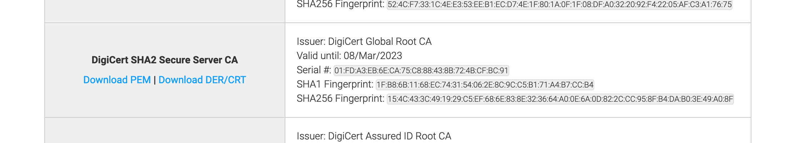

You bought a certificate from an authority. You deployed your application with
this certificate at example.com. You verified this with `curl
https://example.com` and it works great. You told your customer they can
connect.

Aaand they say your certificate is not trusted because your app does not provide
the full certificate chain. Whoa?

I am not a security expert so I won't go into details of TLS certificates. But
I'll show you how you can deploy your application with full certificate chain so
that your customer will stay happy.

Prerequisites:

1. Download [openssl](https://www.openssl.org/source/). This article heavily
   uses openssl tool.

## Get your certificate

I assume you have your certificate already. If not, download it. In this
example, we will use example.com. I downloaded their certificate by

```shell
$ echo | openssl s_client -servername example.com -connect example.com:443 |\
  sed -ne '/-BEGIN CERTIFICATE-/,/-END CERTIFICATE-/p' > certificate.crt
```

## Verify that your certificate is indeed not trusted

You can verify what your customer sees. Use this script
[verify-ssl.sh](https://gist.github.com/kaskavalci/46aaf62465f361194fa3c05ffeb810e0)
to verify if the certificate indeed provides a complete chain.

Let's try it with example.com

```shell
$ ./verify-ssl.sh certificate.crt
 0: subject= /C=US/ST=California/L=Los Angeles/O=Internet Corporation for Assigned Names and Numbers/OU=Technology/CN=www.example.org
issuer= /C=US/O=DigiCert Inc/CN=DigiCert SHA2 Secure Server CA

certificate.crt: C = US, ST = California, L = Los Angeles, O = Internet Corporation for Assigned Names and Numbers, OU = Technology, CN = www.example.org
error 20 at 0 depth lookup:unable to get local issuer certificate
```

A-ha! Now, we can reproduce this in our environment, let's fix this issue!

## Find your CA

Every certificate is signed by a Certificate Authority (CA). Yours included. Find
the CA that signed your certificate. There is a simple way to reveal that:
`openssl`.

```shell
$ openssl x509 -noout -subject -issuer -in certificate.crt
subject= /C=US/ST=California/L=Los Angeles/O=Internet Corporation for Assigned Names and Numbers/OU=Technology/CN=www.example.org
issuer= /C=US/O=DigiCert Inc/CN=DigiCert SHA2 Secure Server CA
```

It seems like DigiCert is the issuer of our certificate for example.com. A quick
web search now [q=DigiCert Root
CA](https://duckduckgo.com/?t=ffab&q=digicert+root+ca&ia=web). Let's find out
the website of our issuer, DigiCert.

You'll most likely find the issuer website and they will list their CA
certificates. In our example, it is listed
[here](https://www.digicert.com/digicert-root-certificates.htm).

## Download Root CA Certificate

First, download your CA's Root certificate: `DigiCert Global Root CA`

Our issuer is `DigiCert SHA2 Secure Server CA`. Searching that in [DigiCert Root
Certificate](https://www.digicert.com/digicert-root-certificates.htm) yields to
following result



Download the certificate (PEM format) and open it in a text editor. You'll see
something like:

```
-----BEGIN CERTIFICATE-----
MIIEl....
-----END CERTIFICATE-----
```

Copy the contents and paste in your certificate.crt / pem file. So, your
certificate will look like:

```
# Our certificate (https://example.com)
-----BEGIN CERTIFICATE-----
MIIHQDCCBiigAwIBAgI...
-----END CERTIFICATE-----

# Intermediate (DigiCert SHA2 Secure Server CA)
-----BEGIN CERTIFICATE-----
MIIElDCCA...
-----END CERTIFICATE-----

# Root (DigiCert Global Root CA)
-----BEGIN CERTIFICATE-----
MIIDrzCCApegAwIBAgIQCDvgVpBCRrGhdW...
-----END CERTIFICATE-----
```

Three certificates in one file! Let's try again.

```shell
$ ./verify-ssl.sh certificate.crt
 0: subject= /C=US/ST=California/L=Los Angeles/O=Internet Corporation for Assigned Names and Numbers/OU=Technology/CN=www.example.org
issuer= /C=US/O=DigiCert Inc/CN=DigiCert SHA2 Secure Server CA
subject= /C=US/O=DigiCert Inc/CN=DigiCert SHA2 Secure Server CA
issuer= /C=US/O=DigiCert Inc/OU=www.digicert.com/CN=DigiCert Global Root CA
 1: subject= /C=US/O=DigiCert Inc/OU=www.digicert.com/CN=DigiCert Global Root CA
issuer= /C=US/O=DigiCert Inc/OU=www.digicert.com/CN=DigiCert Global Root CA
 2:
certificate.crt: OK
```

Great! Our certificate is now trusted. If you deploy your application with this
certificate, which also includes CA chain, it will be trusted from clients.

### Hey, wait. I did this and my certificate is still not trusted!

In this case, you either did not find the correct Root CA or your intermediate.
You probably received the intermediate certificate from your provider. If not,
check their website or ask for it. Procedure is simple, just append their
certificate to your certificate file. Test again with `verify-ssl.sh` tool.

## It's time to deploy!

You deployed your application. You want to verify if all is good. Let's check it
with, you guessed it, `openssl`.

```shell
$ openssl s_client -showcerts -connect example.com:443
CONNECTED(00000005)
depth=2 C = US, O = DigiCert Inc, OU = www.digicert.com, CN = DigiCert Global Root CA
verify return:1
depth=1 C = US, O = DigiCert Inc, CN = DigiCert SHA2 Secure Server CA
verify return:1
depth=0 C = US, ST = California, L = Los Angeles, O = Internet Corporation for Assigned Names and Numbers, OU = Technology, CN = www.example.org
verify return:1
---
Certificate chain
 0 s:/C=US/ST=California/L=Los Angeles/O=Internet Corporation for Assigned Names and Numbers/OU=Technology/CN=www.example.org
   i:/C=US/O=DigiCert Inc/CN=DigiCert SHA2 Secure Server CA
...
...
    Start Time: 1587495443
    Timeout   : 7200 (sec)
    Verify return code: 0 (ok)
```

I skipped the certificates but it will print all certificates presented in the
certificate chain. Important bit is, `Verify return code: 0 (ok)`. If you see
this, it means your certificate is rock solid and ready to be trusted!
