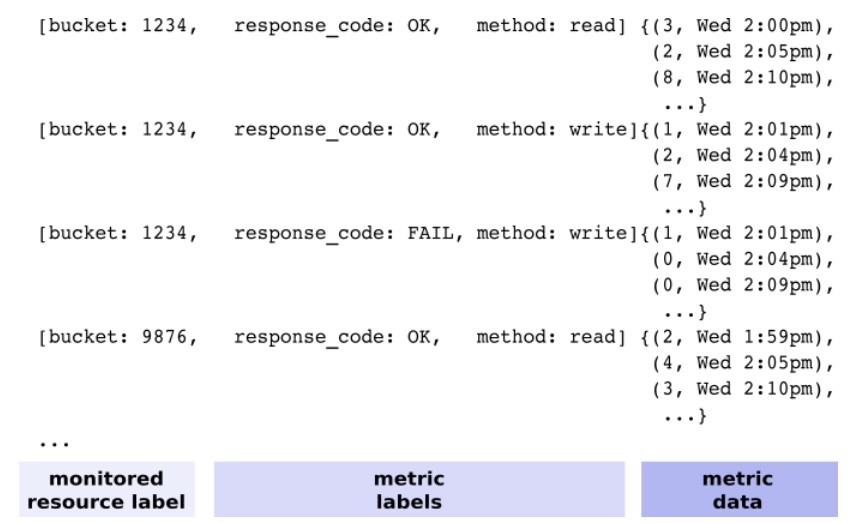
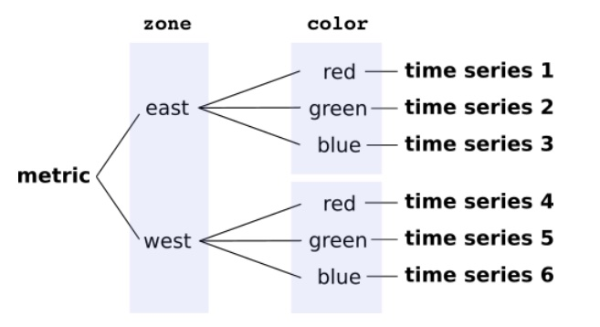

This post focuses on how does metric labels work with Google Cloud Monitoring
and the costs around it.

Labels are useful with metrics to capture details of the event. If you are
collecting metrics from a HTTP endpoint, possible values would be `method`
and `response_code`. This would help classifying the events with respect to
their characteristics. Below is an example from [Google Cloud Monitoring](https://cloud.google.com/monitoring/api/v3/metric-model#generic-label-info).

Image Credit: Google

Labels are great but you should be careful using them. This is because
[Cardinality](https://cloud.google.com/monitoring/api/v3/metric-model#cardinality).
Each label combination creates a new time series.

Image Credit: Google

This behavior means, labels should be finite and preferably a small set.

## How does the data change if we add a variable label?

Let's see what happens if we add a variable label to an existing metric. In this
example we added current timestamp as a label. If you think it is a bad idea,
spoiler alert, it is.

Change was deployed on December 6th. You can see a significant increase
afterwards which accumulates over time.

## What about cost?

Metrics are expensive. Very expensive. To give you context, below is the cost
breakdown compared to logs.

| Monitoring Resource | Storage Size | Cost |
| ------------------- | ------------ | ---- |
| Metrics             | 2 GiB        | $552 |
| Logs                | 170 GiB      | $60  |

## Conclusion

Short breakdown of this expensive lesson.

- Metrics are expensive
- Labels are intended for finite and small set of data
- Avoid adding too much labels to reduce ingested bytes
